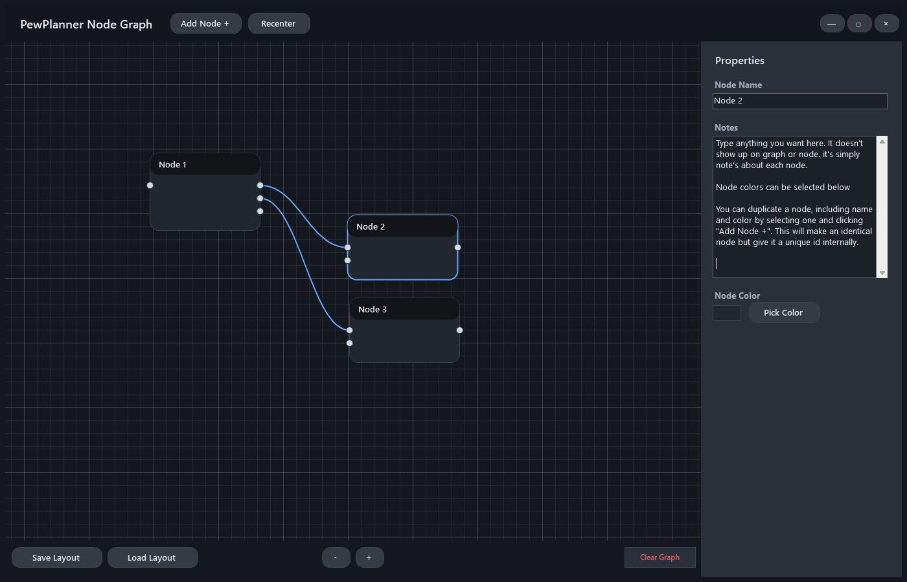
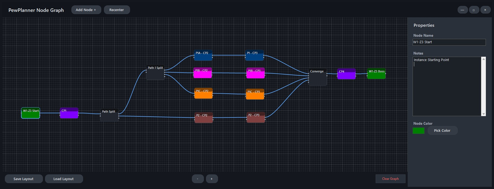

# PewPlanner
PewPlanner is a simple and portable node graph that lets you plan out simple flow charts and connections with only the simplest controls, save, them, load them, etc. just as fast as you started the project!

### Features
- Super simple navigation
- Notes saved for each node
- Custom colors saved for each node
- Auto input/output generation
- Save/Load .pew files
- quick recenter and clearing of graphy
- Duplicate a node by selecting it and clicking the Add Node button

### Simple Navigation
- Pan: Middle Mouse Drag or Arrow Keys
- Zoom: Middle Mouse Wheel or +/- UI buttons

## 📸 Screenshots

### Basic Graph Diagram/Explanation Notes

### Split / Converge Example

